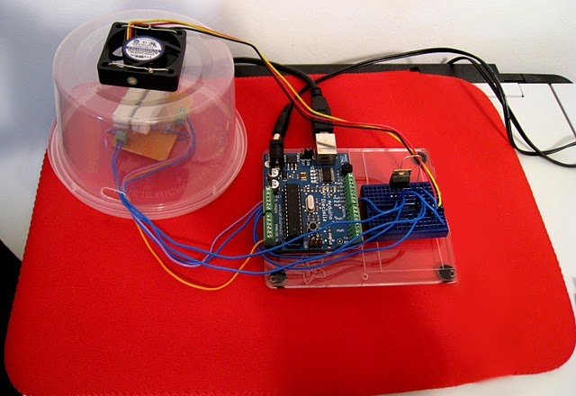
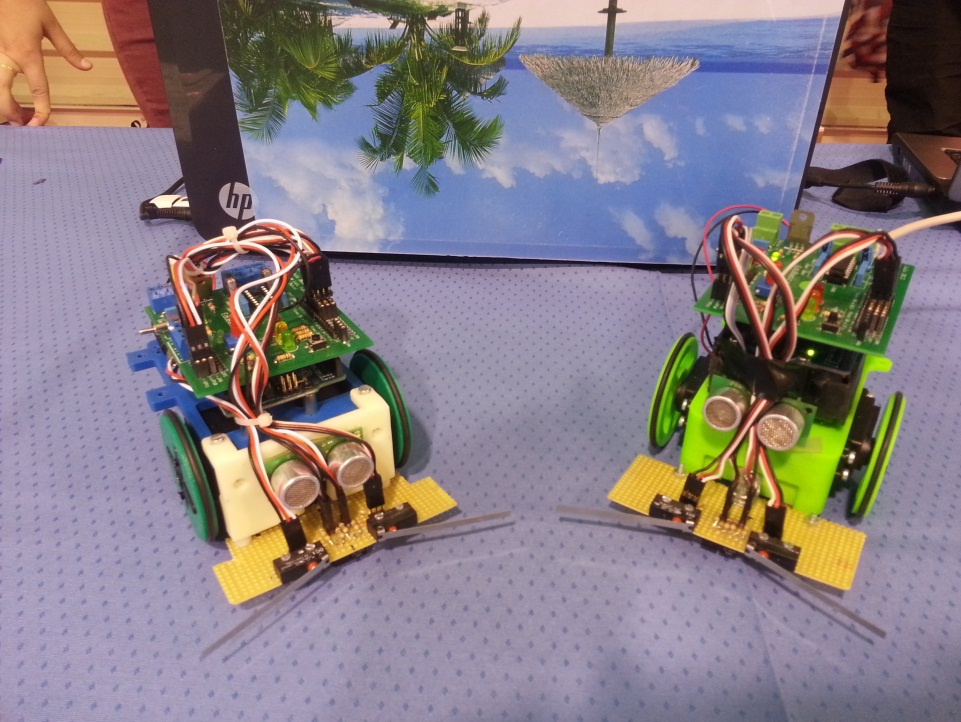

# Proyectos con EduBasica

En esta sección tenemos proyectos con EduBasica-Arduino.
# Maqueta de Control de barrera de parking

Este proyecto es una actualización del realizado en el Taller de Robótica Educativa en el IES Pintor Rafael Requena de Caudete-Albacete en el curso 2011-2012.

Video: https://www.youtube.com/watch?v=ucT549aUI94

Presentación: http://platea.pntic.mec.es/~mhidalgo/page5.html

Acceso a la actualización: https://github.com/leobotmanuel/EduBasica/blob/master/Proyectos/controlBarreraParking/README.md
# Maqueta de Control de temperatura

Este proyecto se basa en la colaboración de Igor R., Alberto Yedra y LeoBot (Manuel) por la fecha de julio del 2011 en la Campus Party de Valencia.

Fuente: http://real2electronics.blogspot.com.es/2011/07/maqueta-de-control-pid-con-arduino.html
# Robot imprimibles

Proyectos de robots imprimibles que tanta aceptación ha tenido en el aula como trabajo para desarrollar los contenidos de electrónica, programación y documentación digital.
