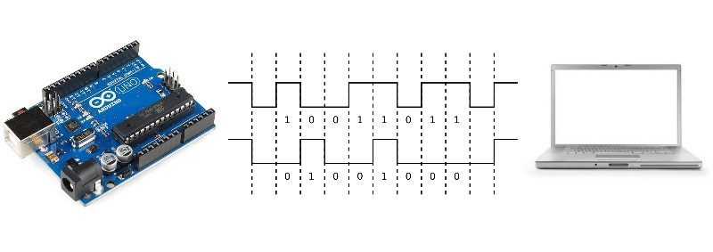

# Comunicaciones. Puerto serie (USB)
El puerto serie de Arduino se usa para transmitir y recibir datos de otros dispositivos como un PC, teléfono móvil, tablet o microcontrolador.

El puerto serie del Arduino Uno usa los pins 0(RX) y 1(TX). Estos están conectados al controlador FTDI (ATmega 16u2) que es el que permite la traducción del formato serie TTL a USB. Estos pins no pueden ser utilizados mientras se usa la comunicación serie.
Más información del [puerto serie](http://diymakers.es/usando-el-puerto-serie-del-arduino/)

