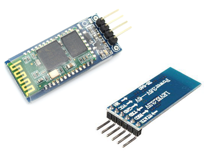
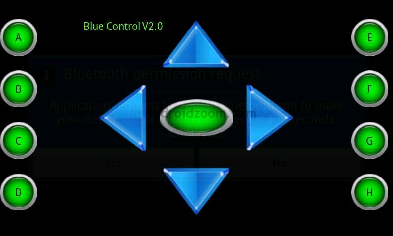

# Bluetooth
El Bluetooth es un estándar de comunicación inalámbrica que permite la transmisión de datos a través de radiofrecuencia en la banda de 2,4 GHz. 

El módulo de bluetooth en EduBasica se conecta en un zócalo de 4 pines.
-    El pin de transmisión del Bluetooth Tx se conecta al de recepción de Arduino Rx.
-    El pin de recepción del Bluetooth Rx se conecta al de transmisión de Arduino Tx.
-    El pin Vcc del Bluetooth al (+).
-    El pin GND del Bluetooth al (-)
**IMPORTANTE:**
En el momento de cargar el programa desde el Visualino a la placa Arduino hay que desconectar el módulo de Bluetooth para que no interfiera.

Para ello utilizaremos un módulo HC-06 para Arduino y la aplicación para Android Bluecontrol.

Ambos dispositivos, módulo Bluetooth y telefóno móvil o tablet, se tienen que emparejar y compartir una contraseña para que los datos puedan intercambiarse. Por defecto, estos módulos tienen la contraseña 1234. Normalmente el módulo de bluetooth tiene un LED que parpadea cuando se está intentando conectar con el móvil. Una vez hecho, la luz del LED permanece fija.

El programa, que tenemos que cargar en Arduino, para aprender su funcionamiento con Visualino:

- prog11_bluetooth.bly

